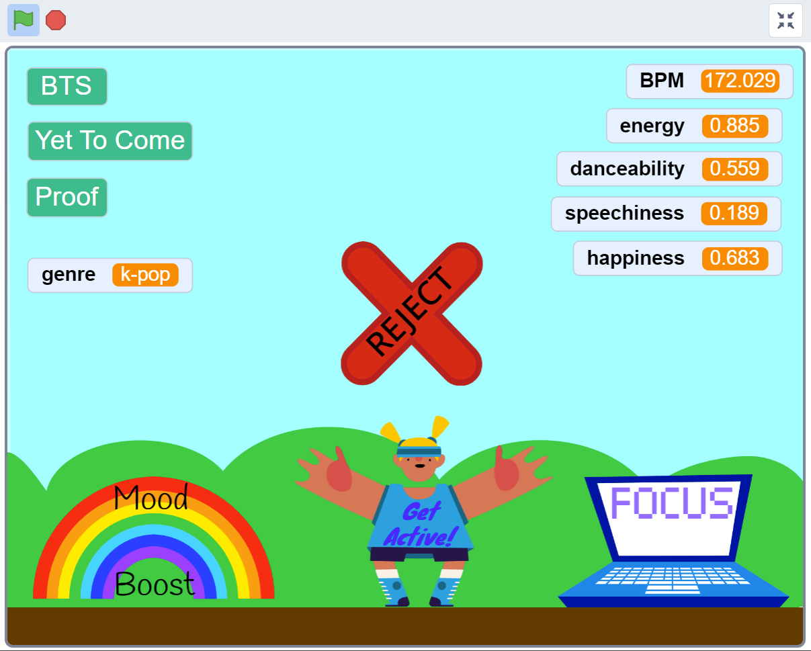

## Introduction

In this project, <mark> short project description </mark>

<mark>Boxout (wherever wanted/needed) </mark>

**Term** description of term or interesting phrase.

## Introduction
In this stage of the ExperimentAI Music quest, you will build the Scratch program that allows you to start playing and classifying music.

If you haven’t done much coding with Scratch before, get up to speed by trying our short warm-up project, [Space Talk](https://projects.raspberrypi.org/en/projects/space-talk){:target="_blank"}.

### You will:
+ Create or Log in to your ML4Kids account and create a new machine learning model
+ Create a Scratch project which:
+ Searches an online music database by genre and returns random results in that genre
+ Allows the user to classify songs
+ Allows the user to click a sprite that rejects a song entirely and labels it as such in the model

