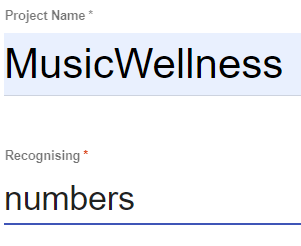

## Create your machine learning model

First, create your machine learning model on Machine Learning for Kids:

--- task ---

Open the website Machine Learning for Kids (machinelearningforkids.co.uk).

--- /task ---

--- task ---

Select Log in from the top menu. 

In the screen that appears, choose **Sign Up** if you are creating your own account and follow the prompts to create a new account.

Choose **Log In** if your mentor gave you some login details. Enter your username and password on the next screen.

--- /task ---

--- task ---

Select Go to your Projects.

--- /task ---

--- task ---

Select Add a new project.

--- /task ---

--- task ---

Give the project a name and set it to recognise numbers.

--- /task ---

Now that you have a project that identifies numbers, you need to define what numbers you want it to identify: the audio features data for each song.

Musical Audio Features  
 
**acousticness** - A confidence measure from 0.0 to 1.0 of whether the track is acoustic - which means the track doesn’t use electronic instruments. The closer to 1.0 the acousticness value is, the less likely it uses electronic instruments.
  
**danceability** - Danceability describes how suitable a track is for dancing! A value of 0.0 is least danceable and 1.0 is most danceable.
  
**energy** - Energy is a measure from 0.0 to 1.0 and represents a perceptual measure of intensity and activity. Typically, high energy tracks feel fast, loud, and noisy.
  
**instrumentalness** - Predicts whether a track contains no vocals. "Ooh" and "aah" sounds are treated as instrumental in this context. Rap or spoken word tracks like podcasts are clearly "vocal". The closer the instrumentalness value is to 1.0, the greater likelihood the track contains no vocal content. 
  
**liveness** - Detects the presence of an audience in the recording. Higher liveness values represent an increased probability that the track was performed in front of people at a concert rather than in a studio.
  
**loudness** - The overall loudness or volume of a track in decibels (dB). 
speechiness - Speechiness detects the presence of spoken words in a track. The more exclusively speech-like the recording (e.g. talk show, audio book, poetry), the closer to 1.0 the speechiness value. 
  
**bpm** (aka. tempo) - The overall estimated tempo of a track in beats per minute (BPM). In musical terminology, tempo is the speed or pace of a given piece and derives directly from the average beat duration.
  
**happiness** (aka. valence) - A measure from 0.0 to 1.0 describing the musical positiveness conveyed by a track. Tracks with high happiness sound more positive (e.g. happy, cheerful, euphoric), while tracks with low happiness sound more negative (e.g. sad, depressed, angry).

The music database we are using uses machine learning to analyse and catalogue every song in their library based on the way it sounds, and record this information in several different ways called **audio features**. You’re going to use the audio features of the songs you like to train a machine learning model to recommend other songs you might like, too.

--- task ---

**Choose: Pick at least 5 audio features from the list to use as values in your model**

--- collapse ---
---
title: Pro Tip - The more audio features used in your model, the more precise it can be
---

By providing extra data to compare against one another, you are providing a much broader representation of the music you like and why it sounds the way it does. When it comes time to use the model to predict music you might like, the predictions will be closer to your tastes if you have more ways to measure what that actually means.

On the flip side; the more audio features you use, the more variables you will need to keep track of in your code. While scratch blocks *can* get quite long with a lot of variables, this is the only real downside to adding *all* of the audio features to your application.

--- /collapse ---

--- /task ---

**HOLD UP!**

You can’t move forward from this point until you know what your application's **audio features** are - you need to know this to be able to create a machine learning model!

Write down which audio features you will be tracking for the next step somewhere - it will make it quicker if you have a reference.

