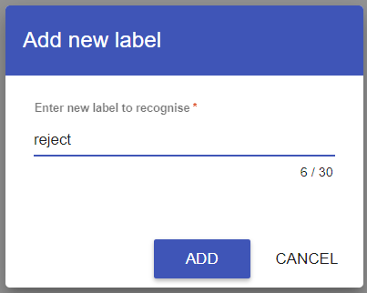
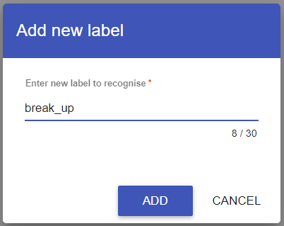
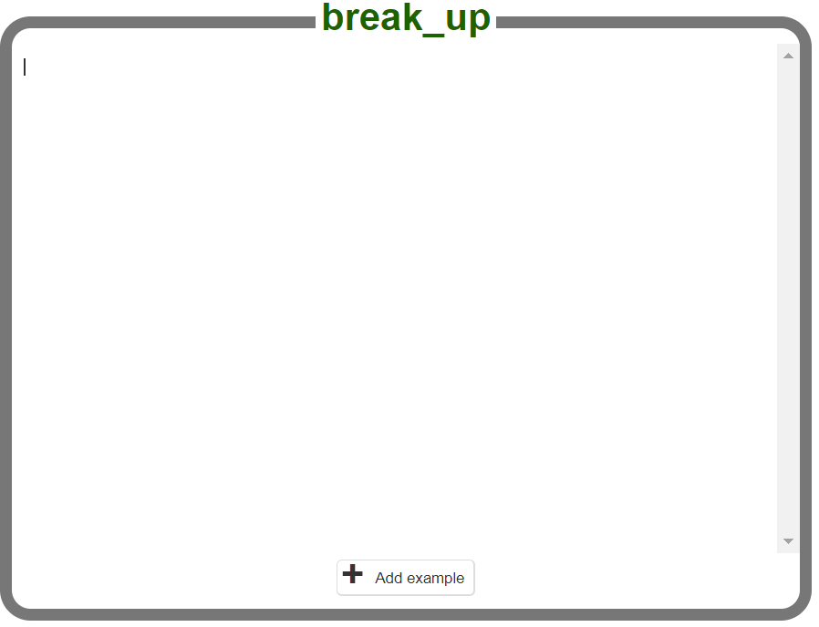

## Add values to your model

Set the values in your new project. You’ll need to add a new value each time and make sure each value is a number.

--- task ---

Select Add a Value

--- /task ---

--- task ---

Enter the name of the first value from your list and set the **Type of value** to **number**

--- /task ---

--- task ---

Repeat for all of the audio features in your list, making sure they are all **number** values.

--- /task ---

--- task ---

When you have added all your audio features and checked them, click Create.

--- /task ---

Amazing! Your model is now ready to receive **values**, but it’s missing one important thing - **labels**.

**Labels** are how the model recognises the different **classes** we will use to group our songs: our playlist names from the previous stage. While the model is tracking all the audio features of a song, the user labels that data and places it in a class based on whether they think it belongs there. 

For example, if you’re listening to a song that you define as a `heartbreak` track, you need to take all the information about it (the values) and label that data with `heartbreak`. This puts it into the `heartbreak` class. Once the model groups the data in this way, it can analyse it and then make predictions based on it.

The classes you choose could be for times in your user’s life when they might want specific kinds of music playing, or for specific audio features for the model to prefer or avoid. You could have classes for relaxation, mental focus, or getting physically active just as easily as playlists for quiet, loud or live performances. 

--- task ---

**Choose: Pick at least three classes for your model which represent your playlists**

--- /task ---

## Add Labels to your model

--- task ---

Click the name of your project on your projects page

--- /task ---

--- task ---

Select **Train**

--- /task ---

--- task ---

Select Add new label and create a label called `reject`. 
This is what we will label any songs we don’t like.

--- /task ---

--- task ---

Select **Add new label** and create a label for the first playlist name in your list.

--- /task ---

--- task ---

Repeat this step to create labels for each of your playlist names.

As you add them, they will appear as boxes in your model’s training page, ready to receive data.

--- /task ---

--- task ---

When you have added a label for each playlist, select **Back to project**.

--- /task ---

In the next step, you'll start coding the application to train your model in Scratch!