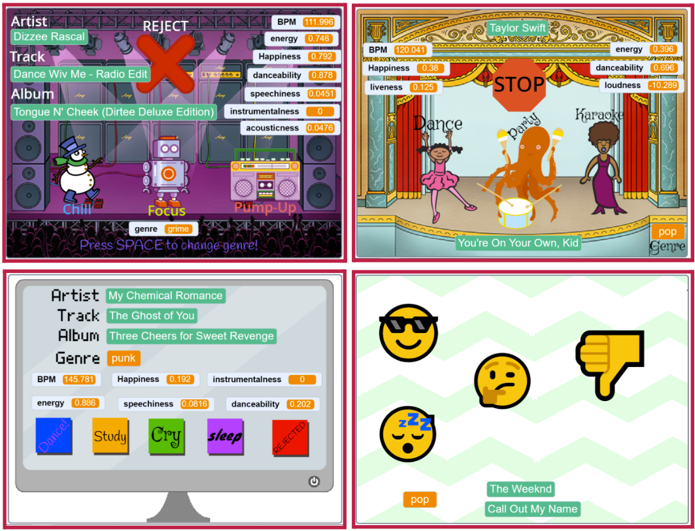
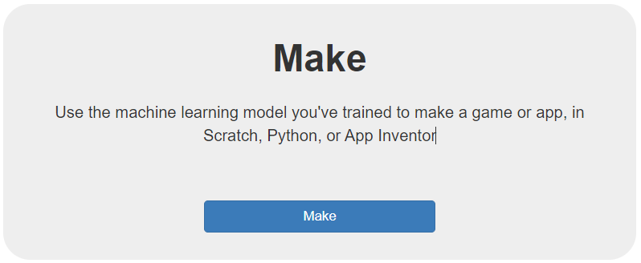
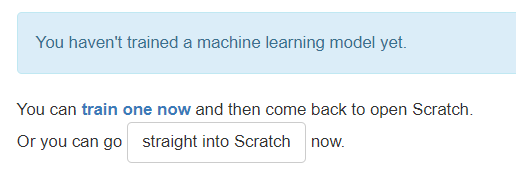
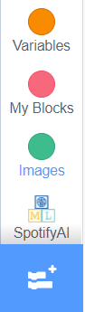

## Make a Scratch application to classify songs

Your model is ready to train, but to do that you need to create a scratch project that can allow your user to listen to and classify songs for training your model.

{:width="300px"}

### **Your project will:**
+ Search an online music database and play random songs
+ Store the song’s audio features data as variables
+ Send the audio features data back to your model on machine learning for kids

### **Your project should:**
+ Have clearly recognisable sprites for each of your playlist classes
+ Display track and artist information of the current sample 
+ Choose another song after the current one has played
+ Have a way to skip repeated songs without labelling them

### **Your project could:**
+ Have a way to change genre while it is running
+ Display audio features data of the current sample
+ Have a way to collect song names and artist info for each label
+ Have animations that run during playback

--- task ---

On your [**project page**](https://machinelearningforkids.co.uk/#!/projects), select **Make**:

--- /task ---

--- task ---

On the next page, select Scratch 3

**NOTE:** You will get a warning telling you that you haven’t trained a model yet - it’s not a problem; that’s what we are about to do! 

**Select** straight into Scratch by clicking the button:

--- /task ---

A special fork of Scratch will open in a new tab. When it does, you will see an item in the left-hand menu with the same name as your machine learning project.

The new grey blocks you can see in that menu allow you to access your machine learning model from within your project:

--- task ---

--- /task ---

--- save ---