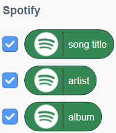

## Pick a genre to search
<p style='border-left: solid; border-width:10px; border-color: #0faeb0; background-color: aliceblue; padding: 10px;'>
In this step, you will create the code that searches the music database for songs and a list of variables which represent the chosen audio features of each song.
</p>

--- task ---

To get started, delete the cat sprite by clicking the little bin icon on its tile beneath the stage.


--- /task ---

--- task ---

In the orange `Variables`{:class="block3variables"} menu, select `Make a Variable`.


--- /task ---

--- task ---

In the popup, name the new variable genre and select OK.


You will see a few new orange blocks appear in the `Variables`{:class="block3variables"} menu.

--- /task ---

--- task ---

Select `Make a Variable` again, but name this variable the first of your selected audio features from earlier.


Select **OK**.

--- /task ---

--- task ---

**Repeat these steps** until your have a variable block for all of your chosen audio features and one for genre:

All of the variables you create will have their blue box ticked by default. This means that they are being displayed with a readout on the stage.

--- collapse ---
---
title: Pro tip - Seeing or hiding variables
---

+ Unticking the blue box next to each variable will hide the readout for that variable on the Stage. 
+ You can set the readout style for each variable by double-clicking it on the stage.

--- /collapse ---

--- /task ---

Now that you have all the extensions and variables you need ready to code, you can start making a program to classify your songs. 

To do this, you need to get Scratch to search for a song in one of your genres and play it so you can listen to it. 

--- task ---

Add a `when green flag clicked`{:class="block3events"} block to your workspace. This is the script that will run the first time we start the project. 

```blocks3
when green flag clicked
```

--- /task ---

--- task ---

In the blue `Sensing`{:class="block3sensing"}  menu, add an `ask (What's your name?) and wait`{:class="block3sensing"} block:

```blocks3
when green flag clicked
ask [What's your name?] and wait
```

--- /task ---

--- task ---

Change the question text to something you like. Ask your user to enter a genre, to start the search. You could say something like:
+ What genre would you like?
+ What are we listening to today?
+ Enter music genre to start!
+ What kind of music do you want to hear?

```blocks3
when green flag clicked
ask [What genre do you want?] and wait
```

--- /task ---

--- task ---

In the orange `Variables`{:class="block3variables"} menu, add a `set [genre] to (0)`{:class="block3variables"} block, and make sure the pull-down menu in the block is set to **genre**.

```blocks3
when green flag clicked
ask [What genre do you want?] and wait
set [genre] to (0)
```

--- /task ---

--- task ---

Back in the blue `Sensing`{:class="block3sensing"} menu, drag the round blue `answer`{:class="block3sensing"} bubble across and place it in the hole in the `set [genre] to (0)`{:class="block3variables"} block, replacing the 0:

```blocks3
when green flag clicked
ask [What genre do you want?] and wait
set [genre v] to (answer)
```

--- /task ---

--- task ---

**Click the green flag.**

Your script will run, and a prompt will appear, asking you what genre of music you want.

--- /task ---

--- task ---

**Type** something into the prompt and press **Enter**.

You should see your genre readout in the stage change to what you just typed. 

--- collapse ---
---
title: Pro Tip - getting the right genre
---

You can only use genres that the music database recognises in the answer field. If you enter something it doesn’t recognise, your program won’t play any music. (That includes bad spelling and typos!)

Some good places to start might be: `pop`, `rock`, `punk`, `dance`, `party`, `pride` or `indie`. You can also [browse the genres available on Spotify here](https://open.spotify.com/genre/hub-browse-grid){:target="_blank"}.

--- /collapse ---

--- /task ---

--- task ---

From the `Spotify`{:class="block3custom::338854"} menu, add a `random song from genre (pop)`{:class="block3flag"} block to the bottom of your script

```blocks3
when green flag clicked
ask [What genre do you want?] and wait
set [genre v] to (answer)
random song from genre [pop] :: #338854
```

--- /task ---

--- task ---

From the `Variables`{:class="block3variables"} menu, drag the small, round, orange `genre`{:class="block3variables"} bubble across and place it inside the hole in the `random song from genre (pop)`{:class="block3flag"} block, replacing the word pop:

```blocks3
when green flag clicked
ask (What genre do you want?) and wait
set [genre v] to (answer)
random song from genre (genre) :: #338854
```

--- /task ---

--- task ---

From the `Spotify`{:class="block3flag"} menu, add a `play preview`{:class="block3flag"} block to the bottom of your script:

```blocks3
when green flag clicked
ask [What genre do you want?] and wait
set [genre v] to (answer)
random song from genre (genre) :: #338854
play preview :: #338854
```
--- /task ---

--- task ---

**Compare** your code with the example code above and make sure everything is exactly the same.

--- /task ---

--- task ---

**Click the green flag** and enter a genre into the prompt. 

**Press Enter**. You should hear music playing from the genre you entered!

--- /task ---

### Debug:

**Check the song information readouts when you run your program. Are they showing any information, or are they blank?**

--- collapse ---
---
title: Pro tip - song information display
---

+ Show the song information by clicking the ticks next to the bubbles in the Spotify menu
+ Double-click the readouts for the song information to change their style



--- /collapse ---

**The readouts are blank:** your program hasn’t found a song on the music database.

**The readouts show information about the song, artist and album:** your program is playing a song, but you can’t hear it.
 
 --- collapse ---
 ---
 title: Your program hasn’t found a song on the music database
 ---
 
+ Have you correctly spelled the genre you want to search? Misspellings will result in your search returning nothing.
+ Have you inserted the genre bubble in the random song from genre block? It should look like this: 

```blocks3
random song from genre (genre) :: #338854
```

--- /collapse ---

--- collapse ---
---
title: Your program is playing a song, but you can’t hear anything
---

+ Make sure your headphones are properly plugged in (if you have them), and that your sound is turned on.


--- /collapse ---


In the next step, you will use the green `Spotify`{:class="block3flag"} blocks to search the online music database for songs to label. 
