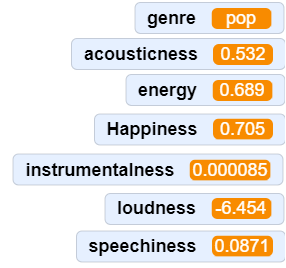

## Collect song data

Now that you can search a genre in the music database, you need to be able to send the audio features data to your model. To do that, store each audio feature as the variable you created of the same name.

--- task ---

**Detach** the play preview block from your script. 

You are about to add a lot of blocks to this script, and you don’t want your ears blasted off by accidentally playing music all the time.

```blocks3
when green flag clicked
ask [What genre do you want?] and wait
set [genre] to (answer)
random song from genre (genre) :: #338854

play preview :: #338854
```
--- /task ---

--- task ---

From the `Variables`{:class="block3variables"} menu, add a `set [variable] to (0)`{:class="block3variables"} block to your script, to the bottom of the `random song from genre (genre)`{:class="block3custom"} block.

```blocks3
when green flag clicked
ask [What genre do you want?] and wait
set [genre v] to (answer)
random song from genre (genre) :: #338854
set [acousticness v] to (0)
```

--- /task ---

--- task ---

From the Spotify menu, take the Song (acousticness score) bubble and place it inside the set [variable] to (0) block, replacing the 0:


```blocks3
when green flag clicked
ask [What genre do you want?] and wait
set [genre v] to (answer)
random song from genre (genre) :: #338854
set [acousticness v] to (Song [acousticness score v] :: #338854)
```

--- /task ---

--- task ---

Change the pull-down menu in the orange variable block and the pull-down in the green bubble to match one another:

```blocks3
set [acousticness v] to (Song [acousticness score v] :: #338854)
```

--- /task ---

--- task ---

**Right-click** (or two-finger click on Mac) on the `set [variable] to Song (feature)`{:class="block3variable"} block you just created and choose **Duplicate**:


--- /task ---

--- task ---

Add the duplicated block to the bottom of your script:

```blocks3
when green flag clicked
ask [What genre do you want?] and wait
set [genre v] to (answer)
random song from genre (genre) :: #338854
set [acousticness v] to (Song [acousticness score v] :: #338854)
set [acousticness v] to (Song [acousticness score v] :: #338854)
```

--- collapse ---
---
title: Pro tip - Duplicating blocks quickly
---

Scratch will duplicate all the blocks underneath the one you right-click, allowing you to duplicate multiple blocks or whole sections of code at once!

--- /collapse ---

--- /task ---

--- task ---

**Change both the drop down menus** in the new block to be the next matching variable and feature in your list: 

```blocks3
when green flag clicked
ask [What genre do you want?] and wait
set [genre v] to (answer)
random song from genre (genre) :: #338854
set [acousticness v] to (spotify [acousticness score v] :: #338854)
set [energy v] to (Song [energy v] :: #338854)
```

--- /task ---

--- task ---

**Repeat** these steps until you have added all of the audio features in your list, making sure that the menu items match each time:

```blocks3
when green flag clicked
ask [What genre do you want?] and wait
set [genre v] to (answer)
random song from genre (genre) :: #338854
set [acousticness v] to (spotify [acousticness score v] :: #338854)
set [energy v] to (Song [energy v] :: #338854)
set [happiness v] to (Song [happiness v] :: #338854)
set [Instrumentalness v] to (Song [Instrumentalness v] :: #338854)
set [loudness v] to (Song [loudness v] :: #338854)
set [speechiness v] to (Song [speechiness v] :: #338854)

```

--- /task ---

--- task ---

Replace the play preview block at the end of your script:

```blocks3
when green flag clicked
ask [What genre do you want?] and wait
set [genre v] to (answer)
random song from genre (genre) :: #338854
set [acousticness v] to (spotify [acousticness score v] :: #338854)
set [energy v] to (Song [energy v] :: #338854)
set [happiness v] to (Song [happiness v] :: #338854)
set [instrumentalness v] to (Song [instrumentalness v] :: #338854)
set [loudness v] to (Song [loudness v] :: #338854)
set [speechiness v] to (Song [speechiness v] :: #338854)
play preview :: #338854
```

--- /task ---


--- task ---

**Click the Green Flag**.

You should hear music, and see the song’s audio features displayed in the readouts on your Stage:



--- /task ---

In the next step, you will use broadcasts in your code to repeat the search for songs on the music database.

--- save ---