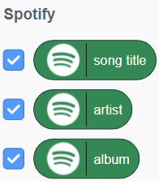

## Collect song data

Add the blocks which will collect the audio features data from each track you hear. 

--- task ---

From the `Spotify`{:class="blocks3custom::338854"} menu, add a `random song from genre (pop)`{:class="blocks3custom::338854"} block to the bottom of your script

```blocks3
when green flag clicked
ask (What genre do you want?) and wait
set [genre] to (answer)
random song from genre (pop) :: #338854
```

--- /task ---

--- task ---

From the `Variables`{:class="blocks3variables"} menu, drag the small, round, orange `genre`{:class="blocks3variables"} bubble across and place it inside the hole in the `random song from genre (pop)`{:class="blocks3custom :: 338854"} block, replacing the word pop:

```blocks3
when green flag clicked
ask (What genre do you want?) and wait
set [genre] to (answer)
random song from genre (genre :: variable) :: #338854
```

--- /task ---

--- task ---

From the `Spotify`{:class="blocks3custom :: 338854"} menu, add a `play preview`{:class="blocks3custom :: 338854"} block to the bottom of your script:

```blocks3
when green flag clicked
ask (What genre do you want?) and wait
set [genre] to (answer)
random song from genre (genre :: variable) :: #338854
play preview :: #338854
```
--- /task ---

--- task ---

**Compare** your code with the example code above and make sure everything is exactly the same.

--- /task ---

--- task ---

**Click the green flag** and enter a genre into the prompt. 

**Press Enter**. You should hear music playing from the genre you entered!

--- /task ---

### Debug:

Check the song information readouts when you run your program. Are they showing any information, or are they blank?

--- collapse ---
---
title: Pro tip - song information display
---

+ Show the song information by clicking the ticks next to the bubbles in the Spotify menu
+ Double-click the readouts for the song information to change their style



--- /collapse ---

+ The readouts are blank: your program hasn’t found a song on the music database.

+ The readouts show information about the song, artist and album: your program is playing a song, but you can’t hear it.
 
**Your program hasn’t found a song on the music database:** 
+ Have you correctly spelled the genre you want to search? Misspellings will result in your search returning nothing.
+ Have you inserted the genre bubble in the random song from genre block? It should look like this: 

```blocks3
random song from genre (genre :: variable) :: #338854
```

**Your program is playing a song, but you can’t hear anything:**
+ Make sure your headphones are properly plugged in (if you have them), and that your sound is turned on.


--- save ---