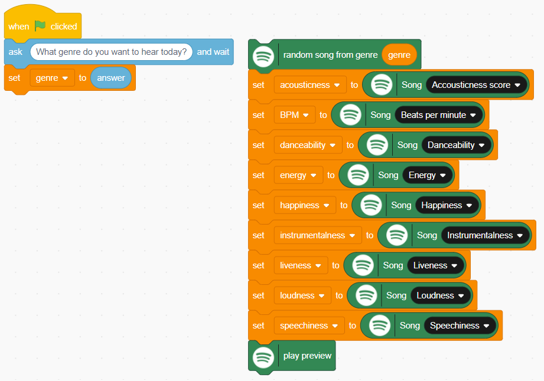
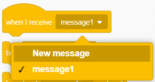
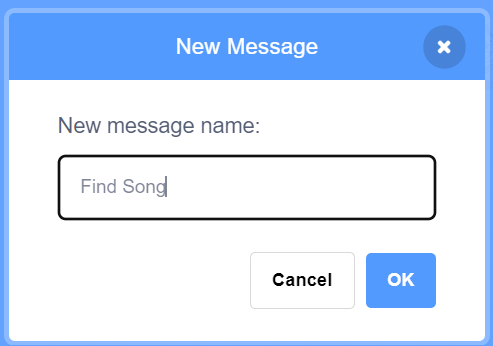
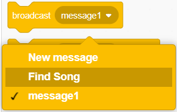

## Keep on searching
<p style='border-left: solid; border-width:10px; border-color: #0faeb0; background-color: aliceblue; padding: 10px;'>
In this step, you will create a new broadcast message and use it to create a loop which will repeat the search for songs.
</p>

Right now, you have an application that can play a song and find out what the audio features of that song are. 

In order to create enough data to train your model, you’ll need to listen to a few dozen songs at least. Waiting to press the green flag every time will be incredibly boring and take a lot more time, but we can automate the process of searching for a song by using **broadcasts**.

--- task ---

In the search script, drag the `random song from genre (genre)`{:class="block3flag"} block away from the `set [genre] to (answer)`{:class="block3variables"} block and put it down next to it in your workspace:



--- /task ---

--- task ---

Open the yellow Events menu and find the `When I receive [message1]`{:class="block3events"} block:

```blocks3
when i receive [message1 v]
```

--- /task ---

--- task ---

In the pull down menu on the When I receive block, select New Message:



--- /task ---

--- task ---

In the popup window that appears, enter the message `Find Song` and **click OK**. 

You will see the message in the block change.



--- /task ---

--- task ---

Add the When I receive [Find Song] block to the top of your large search script: 

```blocks3
when I receive [Find song v]
random song from genre (genre) :: #338854
set [acousticness v] to (spotify [acousticness score v] :: #338854)
set [energy v] to (Song [energy v] :: #338854)
set [happiness v] to (Song [happiness v] :: #338854)
set [instrumentalness v] to (Song [instrumentalness v] :: #338854)
set [loudness v] to (Song [loudness v] :: #338854)
set [speechiness v] to (Song [speechiness v] :: #338854)
play preview :: #338854
```

--- /task ---

--- task ---

**Find** the `broadcast [message1]`{:class="block3events"} block and choose `Find Song` from the pull-down menu:



--- /task ---

--- task ---

Add a `broadcast [Find Song]`{:class="block3events"} block to the end of both scripts on your Stage:


```blocks3
when green flag clicked
ask [What genre do you want?] and wait
set [genre v] to (answer)
broadcast [Find song v]
```

```blocks3
when I receive [Find song v]
random song from genre (genre) :: #338854
set [acousticness v] to (spotify [acousticness score v] :: #338854)
set [energy v] to (Song [energy v] :: #338854)
set [happiness v] to (Song [happiness v] :: #338854)
set [instrumentalness v] to (Song [instrumentalness v] :: #338854)
set [loudness v] to (Song [loudness v] :: #338854)
set [speechiness v] to (Song [speechiness v] :: #338854)
play preview :: #338854
broadcast [Find song v]
```

--- /task ---

--- task ---

**Click the green flag.** 

Once you enter a genre into the prompt that appears and press Enter, you should hear music from that genre and see song audio features information on your stage. 

Once you get to the end of each 30 second song sample, you should automatically hear another one begin and see the song data change on your Stage.

--- /task ---

### Debug

**Check the song information readouts when you run your program. Are they showing any information, or are they blank? Use the ticks to show or hide them:**


**The readouts are blank:** your program hasn’t found a song on the music database.
**The readouts show information about the song, artist and album:** your program is playing a song, but you can’t hear it.
 
--- collapse ---
---
title: Your program hasn’t found a song on the music database
---

+ Have you correctly spelled the genre you want to search? Misspellings will result in your search returning nothing.
+ Have you inserted the broadcast [Find Song] block at the end of both scripts? 
+ Does it have the right message selected in the pull-down menu?

--- /collapse ---

--- collapse ---
---
title: Your program is playing a song, but you can’t hear anything
---

+ Are your headphones properly plugged in (if you have them)? 
+ Is your sound turned on?

--- /collapse ---  

--- collapse ---
---
title: Your program only plays one song at a time
---

+ Do you have `broadcast [Find song]`{:class="block3events"}at the end of both scripts? 
+ Does your larger script start with `when I receive [Find Song]`{:class="block3events"}?
+ Are the blocks broadcasting and receiving the right message - `Find Song`?

--- /collapse ---

--- collapse ---
---
title: Bonus Feature - Skip repeated tracks
---

--- task ---

From the Events menu, add a `When [space] key pressed block`{:class="block3events"} to your workspace:

```blocks3
when [space v] key pressed :: #FBAA2F
```

--- /task ---

--- task ---

From the Events menu, add a `broadcast [Find Song]`{:class="block3events"} block to the bottom.

```blocks3
when [space v] key pressed :: #FBAA2F
broadcast [Find song v]
```

--- /task ---

That's it! You can now use the space bar to skip to the next song if you've already classified the one playing.

**Pro tip:** if you find you’re starting to get a lot of songs you’ve heard before, try changing genre for a while.

--- /collapse ---