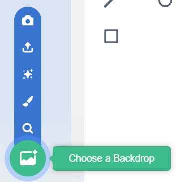
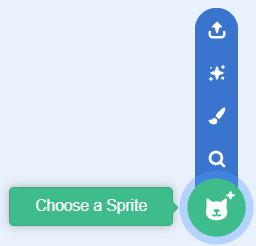

## Design your interface
<p style='border-left: solid; border-width:10px; border-color: #0faeb0; background-color: aliceblue; padding: 10px;'>
In this step, you will take a break from coding and choose a backdrop for your application, add sprites for each of your playlist classes and customise them to create **visual feedback** for the user.  
</p>

Take a break from coding now to add some design elements and colour to your project! Your final submission will be looked at by a panel of experts, and the user interface is an important part of any application. 

**Each playlist you want to generate will need its own sprite.** This will be the way we classify our song data as we are listening - add a sprite for each of your playlists and one for songs you don’t like, then as you are listening you can click the sprite for the playlist you feel the current song fits into.

### Your user interface should:
+ Have easy to distinguish sprites for each playlist
+ Be easy to understand and use
+ Show the current genre being searched
+ Do something to show a sprite has been clicked (change size, costume or colour)

### Your user interface could:
+ Show audio features values for each song
+ Show song information (artist, album, title)
+ Have instructions for the user on screen
+ Have animations for when each sprite is clicked

### Be inspired

Have a look at some of the designs here, what do you notice about them?

+ What do they all have in common?
+ What information do they display?
+ How are they designed and laid out?
+ Do they have a theme?
 


**Choose: Add a backdrop to your application**

--- task ---

Select the Backdrops tab from the top left of your screen:


--- /task ---

--- task ---

**Choose** a backdrop for your project. 

You can choose one from the included library of backdrops, upload one, or paint your own using the paint editor in Scratch.



--- /task ---

**Choose: Add a sprite for each of your playlists and your rejected songs**

--- task ---

**Click** on Choose a Sprite at the bottom right of your screen to open the Sprite Library:



You can search for a sprite, or browse for one by category. 


Click on a sprite to add it to your project. You can also upload sprites, or use the paint editor in Scratch to create your own.

**Pro Tip:** Make sure your sprites don’t look too similar to one another; you don’t want to get them mixed up and get a sad song in your party playlist by mistake!

--- /task ---

--- task ---

**Rename** the sprite to match the playlist label it represents, by using the text field under the Stage:


--- /task ---

--- task ---

**Repeat** these steps until you have a sprite for each of your playlist labels, and one for rejected songs.

--- /task ---

### Visual feedback

Visual feedback is like a signal in the user interface that shows the user that the computer has recognized their action and is doing something in response. For example, when you click a button on a website, the button might change colour or have an animation to show that it's been clicked. That way, you know that the website has recognized your action and is doing something in response, like taking you to a new page, even if you can’t see it happening.

Without visual feedback, it can be hard to know if you've done something correctly or if the computer is doing what you want it to do. So, visual feedback is really helpful to show interaction in a user interface because it helps us know that our actions are being recognised and that the computer is responding in the way we want it to.

There are three simple ways you can add visual feedback to your sprites - by changing costumes, changing size, or altering the colour effect:

```blocks3
when this sprite clicked
next costume
wait (1) seconds
next costume
```


```blocks3
when this sprite clicked
set size to (50)%
wait (1) seconds
set size to (100)%
```


```blocks3
when this sprite clicked
set colour effect to (70)
wait (1) seconds
set colour effect to (0)
```

**Choose: Make sure all of your sprites have some sort of visual feedback for your user**

--- collapse ---
---
title: Pro tip - Coding visual feedback 
---

Remember to add the `wait`{:class="block3control"} block or your user won’t see the feedback; it will happen too fast!

You can copy whole scripts across to other sprites:
+ Select the top block of the script you want to copy
+ Drag the script to the sprite’s thumbnail below the Stage
+ Wait for the thumbnail to ‘wiggle’ side to side
+ Let go of the code by releasing the mouse button


--- /collapse ---

Take some time to make sure you like the look of your application and that it is easy to use and understand. If you’re not sure about any of the sprites in the library, you can always create your own with the paint tool, or upload pictures from your computer. 

### Some tips for designing your user interface:
+ Use the blue tick boxes in the menus on the left of your screen to show or hide variables and song information
+ You can move the readouts on your stage by dragging them around
+ You can change the way the readouts look by double-clicking them
+ Using the paint tool on your stage’s backdrop or sprite’s costume is an easy way to add text

