## Link to your ML model
<p style='border-left: solid; border-width:10px; border-color: #0faeb0; background-color: aliceblue; padding: 10px;'>

</p>

Now that you have an application that can search the music database, return a song and show its audio features data, the next step is to **label** that song’s data in your model with your playlist names from Stage 1. This labelling of data is called **classification**.


It works like this:

1. You listen to a song and decide if you like it. If you don’t, label it as a `reject`.
2. If you do like it, decide which of your playlists it fits into and label it with that playlist name.

When you label a song’s data and add it to a class, you are sending the audio features values for that song back to your model as **training data**. 

The model doesn’t record the song name, artist or which album it comes from - only the number values of the song’s audio features go into training your model.

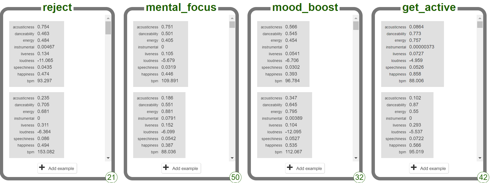

As each class in your model collects more data, the model can more accurately predict (guess) other sets of numbers that might fit into a specific class (songs that sound similar). 

You now need to add the part of your program that takes the data for the song you can hear and labels it in your model. Once you have this function working, you will be able to start listening to and classifying loads of new music! 

### Send training data to your model

Your application needs to send labelled song data back to the model, labelling it correctly in each class. To achieve that, each of your sprites will broadcast a message which will then use the grey Machine Learning 4 Kids model blocks to send data back to the model.

When you click on your sprite, it should:
1. Give visual feedback to the user 
2. Send the training data for the current song back to your model on ML4Kids
3. Stop the current song playing
4. Search for a new song to play

First, set up your sprites to broadcast a message when clicked by the user:

--- task ---

Select the icon beneath the Stage for your `reject` sprite.

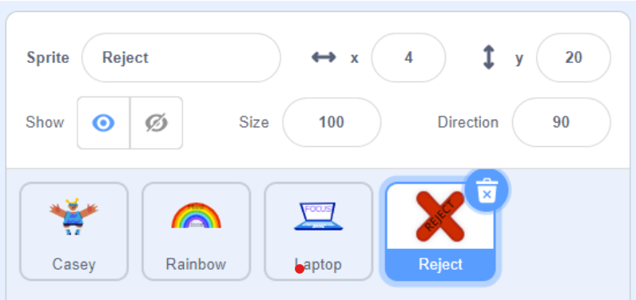

**Pro tip:** You can also tell which sprite is selected by checking at the top right of your workspace for the sprite’s costume!

--- /task ---

--- task ---

Click on the Events menu and drag a `broadcast`{:class="block3events"} block into your visual feedback script, making sure it is at the top, beneath the curved `when this sprite clicked`{:class="block3events"} block:

```blocks3
when this sprite clicked
broadcast [Find song v]
next costume
wait (1) seconds
next costume
```

--- /task ---

--- task ---

From the pull-down menu in the block choose New Message:

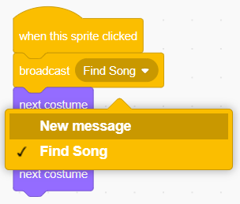

--- /task ---

--- task ---

In the pop-up window that appears, type a message which matches your sprite’s name and the class name in your model:
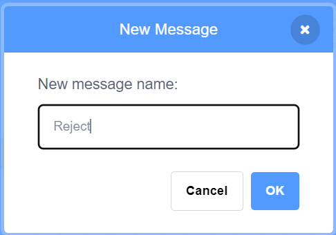

Your broadcast block will change to show the new message:

```blocks3
when this sprite clicked
broadcast [Reject v]
next costume
wait (1) seconds
next costume
```

--- /task ---

--- task ---

**Repeat** these steps for all of your sprites, making sure that:
+ The message being broadcast matches the name of the sprite **and** 
+ The broadcast happens before the sprite’s visual feedback. (Otherwise it will feel like it’s taking ages to do something!)

--- /task ---

Next, create the scripts which will send the data back to your model. 

--- task ---

Click on the **Stage**. You should see your `Find Song` script in the Workspace.
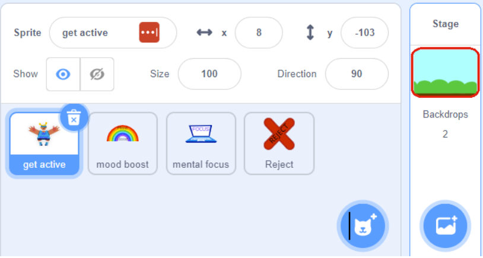

--- /task ---

--- task ---

From the `Events`{:class="block3events"} menu, add a `when I receive`{:class="block3events"} block and choose `reject` from the pull-down menu:

```blocks3
when I receive [Reject v]
```

--- /task ---

--- task ---

Click on the `ML4Kids` menu - it will be named the same thing as your machine learning model and be at the bottom of the list on the left of your screen:
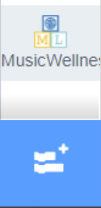

--- /task ---

You will see a whole list of new grey blocks. These blocks allow you to interact with the machine learning model you created earlier.
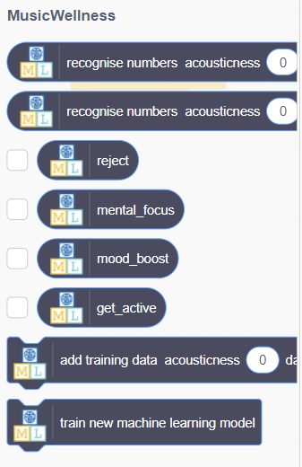

--- task ---

From this list, select the `add training data` block, second from the bottom in the list and add it to the script. It will be quite a long block, as it contains all the values you created in your machine learning model.

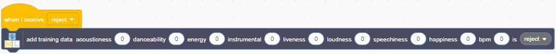

--- collapse ---
---
title: Pro tip - Making more space to work
---

If you need some more room in your workspace, you can:
+ Shrink the stage by clicking the button at the top right 
+ Use the magnifying glass with the negative symbol to zoom out 

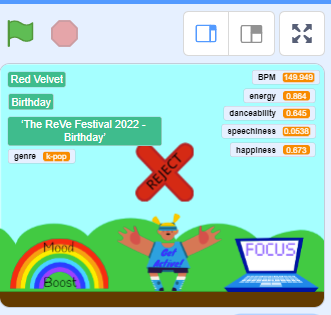

--- /collapse ---

--- /task ---

--- task ---

Select the orange `Variables`{:class="block3variables"} menu. You will see all of the audio features you chose as values listed in the small ‘bubbles’ in the palette on the left.

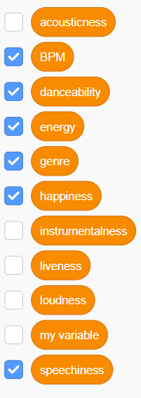

--- /task ---

--- task ---

Fit each variable bubble into the grey add training data block one at a time. They will all be in order, so make sure that the bubble matches the word before it:

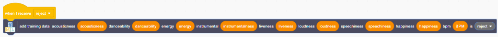

--- /task ---

--- task ---

From the pull-down menu on the end of the long grey block select `Reject`, to match the received message at the top of the script:

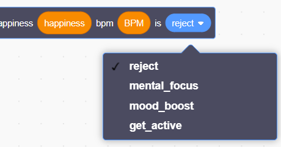

--- /task ---

--- task ---

Select the `Control`{:class="block3control"} menu and add a `wait (1) second`{:class="block3control"} block to your script, just to make sure the training data is sent without another block interrupting:

```blocks3
when I receive [reject v]
add training data acousticness (acousticness) :: #4b4c60
wait (1) second
```

--- /task ---

--- task ---

Select the `Spotify`{:class="block3flag"} menu and add a `stop`{:class="block3flag"} block, so that the current sample stops playing before searching for another song:

```blocks3
when I receive [reject v]
add training data acousticness (acousticness) :: #4b4c60
wait (1) second
stop :: #338854
```

--- /task ---

Finally, get your script to search for another song.

--- task ---


Select the `Events`{:class="block3vents"} menu and add a `broadcast [Find Song]`{:class="block3vents"} block, making sure that the pull-down menu in the block has `Find Song` selected:

```blocks3
when I receive [reject v]
add training data acousticness (acousticness) :: #4b4c60
wait (1) second
stop :: #338854
broadcast [Find song v]
```

--- /task ---

You will need a duplicate of this script for each sprite in your project. Use the duplicate function in Scratch to make it easy!

--- task ---

**Right-click** (or two-finger click on Mac) on the `when I receive [reject]`{:class="block3events"} block at the top of the new script you just created and choose **Duplicate**:

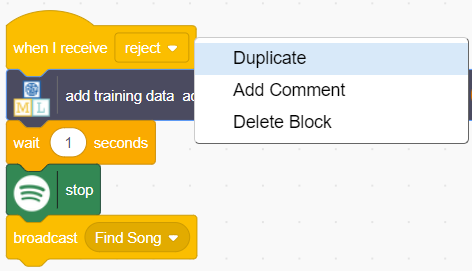

--- /task ---

--- task ---

Place the duplicated script on the Workspace:

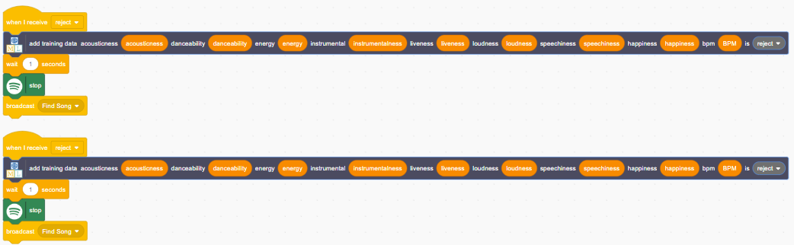

--- /task ---

--- task ---

Change the pull-down menus on the `when I receive`{:class="block3events"} block and at the very end of the grey `add training data` block to the next choice down.

**Remember to make sure the two menus match!**

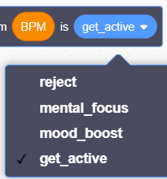 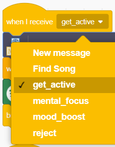

--- /task ---

--- task ---

**Repeat** these steps until you have created a script for all of the classes in your machine learning model, **making sure the pull-down menus in each script match**.

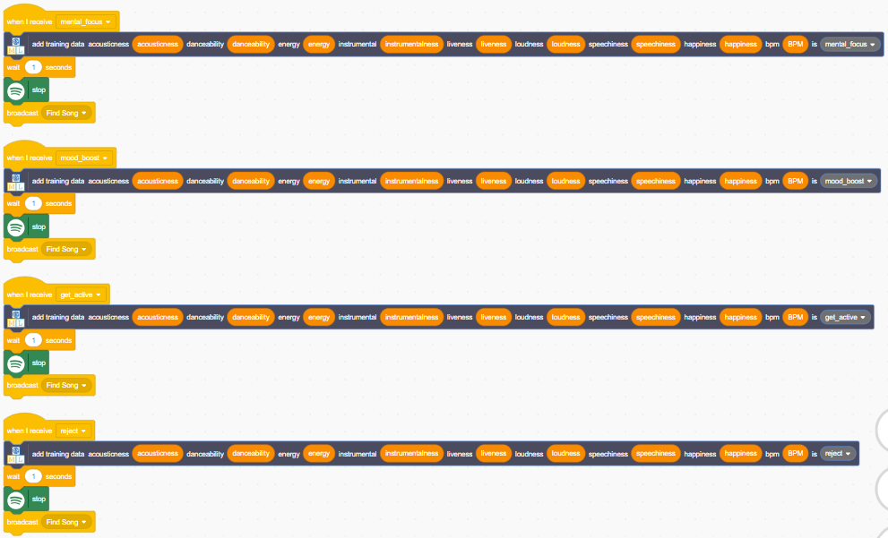

--- /task ---

### Test your application

To test your classifier: 

1. **Click the Green flag**

2. Type in a genre from the list you wrote in Stage 1 and your user can begin classifying music by clicking the sprites. 

3. When the sample begins playing, think about how it sounds. What class does it belong to? Click the sprite that matches the music - you should see some visual feedback and hear a new song after about a second. 

4. Click each sprite a few times, including the reject sprite - don’t worry if the song fits or not, you can delete this data later.

Once you have clicked each sprite a few times, check the model on your Train page to see if you’ve started adding song data to the classes shown there:

--- task ---

Click the name of your project on your [projects page](https://machinelearningforkids.co.uk/#!/projects):


--- /task ---

--- task ---

Select **Train**.


--- /task ---

You should see the different classes in your model begin to fill with data:


--- task ---

If you want to delete the data, click the red X at the top right corner of each entry:

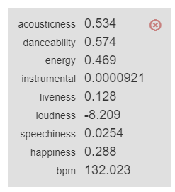

--- /task ---

### Debug

--- collapse ---
---
title: Your program is playing a song, but you can’t hear anything
---

+ Are your headphones properly plugged in (if you have them)? 
+ Is your sound turned on?

--- /collapse ---

--- collapse ---
---
title: Your program doesn’t play another song after you click a sprite
---

+ Do you have `broadcast [Find song]`{:class="block3events"} at the end of your data sending script? 
+ Are the blocks broadcasting and receiving the right message - `Find song`?


--- /collapse ---

--- collapse ---
---
title: Your model doesn’t have data in one or more classes
---

+ Do you have a data sending script for **every sprite** in your application?
+ Do your long grey ML4Kids blocks have each class shown only once in the end pull-down?

--- /collapse ---

You're now ready to begin classifying music!